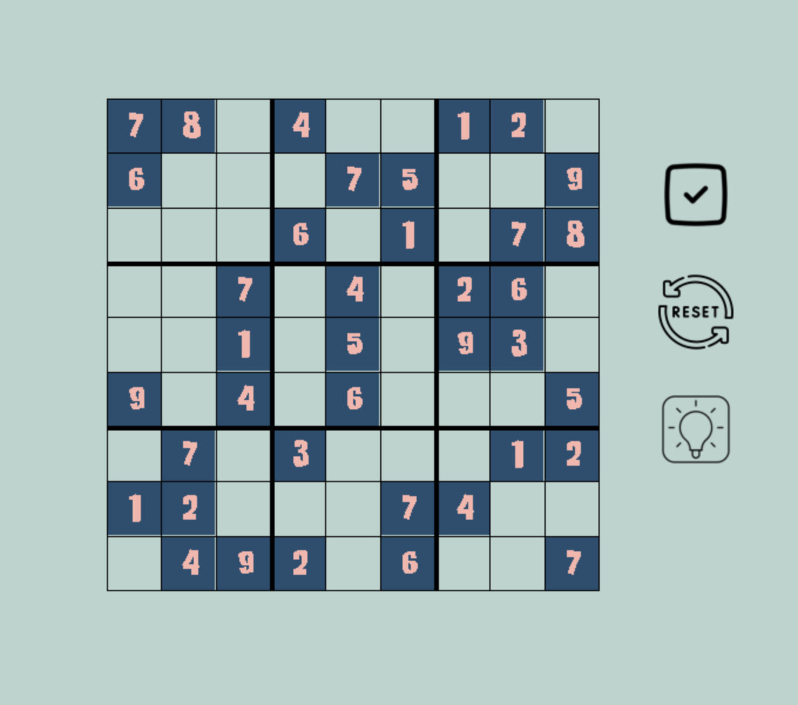

# Sudoku Solver with GUI

A simple Sudoku game application with a solver function.

## Description
A Sudoku game application that displays an interactive grid and button functionalities for checking answers, resetting answers, and solving the Sudoku puzzle.
* To input a number onto a grid box, click on the box and enter your chosen number.
* Reset button will erase all answers on the grid, except answers that have been checked and marked as correct

## Getting Started

### Installation and Execution

* Simply clone the repository and run the game.py file

### Visual Demonstration

## Known Issues

* Reset function only works the first time
* Lacks the feature to change the Sudoku puzzle / input your own
* Lacks the feature to highlight/mark the grid box when it has been selected

## Acknowledgments

GUI inspiration; code snippets for backtracking algorithm:
* [beseo](https://github.com/beseo/Sudoku)
* [techwithtime](https://github.com/techwithtim/Sudoku-GUI-Solver/tree/master)
